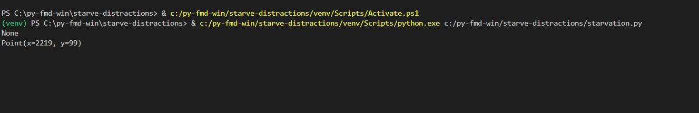

## Table of contents:
- [Introduction](#intro)
- [Technologies](#tech)
- [project Setup](#projo)
- [Illustrations](#illus)
- [Project Information](#info)
- [Contributing](#contri)
- [Acknowledgments](#know)

<INTRODUCTION>

<h1 id="intro">Starve Distractions</h1>


**Task**

Starving distractions that emanate from your favorite social media platforms .
 
**Hypothesis**

- You spend so much time on social media.
- you are a social media addict.
- You find yourself scrolling endlessly on twitter, tiktok, youtube
- You want to get things done but you cannot account where your precious time goes to.

**usage**

The programme is able to intuitively identify any open browser tabs on any chromium search engine such as: brave, google chrome, microsoft edge and search the respective logo images in the screenshot folder then close them using a hot key command : "ctrl" + "w"


<TECHNOLOGIES>

<h1 id="tech">Technologies</h1>

**Builth With**
- Python
- pyautogui


<PROJECT-SETUP>

<h1 id="projo">Project Setup</h1>


## Hardware Requirements
- You will need a desktop or a laptop computer.
- RAM: A minimum of 4GB RAM is recommended.
- Disk Space: You should have at least 5GB free of space on your working hard drive.

## Software Requirements

**environment**

The project was developed (in a windows environment) . It can also run in a mac/linux environment.

**Prerequisites**

To get this project up and running locally, you must already have the following installed:
- [python plus the necessary packages installed on your computer](https://www.python.org/downloads/)
- [code editor ](https://code.visualstudio.com/)


**simple steps to set up on your local machine**

- git clone ```https://github.com/symonkipkemei/starve-distractions.git ```
- Set up and activate the virtual environment.
- run on terminal ```pip install -r requirements.txt```
- Take screenshots of the logo of your favorite but distractive social media platform(s).
- Load/Paste those screenshot logo(s) in the screenshots folder in this directory.
- You will find some already in the screenshots folder.Feel free to ammend/delete some/add.
- run on terminal ```python3 starvation.py   ```
- Sit back , sip tea/coffee and get things done!
- If you come across a bug, leave a message here [issues page](https://github.com/symonkipkemei/api-database-chefbook/issues). I will be glad to assist.


<ILLUSTRATIONS>

<h1 id="illus">Illustrations</h1>




<PROJECT-INFORMATION>

<h1 id="info">Project Information</h1>

**Project Status**
- Complete

**Features**
- Document the number of tabs closed in a day.
- plot a curve of the attempts to use particular distractive platforms.
- Your suggestions 😊............


<CONTRIBUTING>

<h1 id="contri">🤝 Contributing</h1>

Contributions, issues and feature requests are always welcome!

I love meeting other developers, interacting and sharing.

Feel free to check the [issues page](https://github.com/symonkipkemei/api-database-chefbook/issues).

**How to Contribute**

To get a local copy up and running follow these simple example steps.

```
- Fork the repository
- git clone https://github.com/your_username/starve-distractions
- git checkout develop
- git checkout -b branch name
- git remote add upstream https://github.com/symonkipkemei/starve-distractions
- git pull upstream develop
- git commit -m "commit message"
- git push -u origin HEAD
```


<ACKNOWLEDGMENTS>

<h1 id="know">Acknowledgements</h1>

## Author

👤 **Symon Kipkemei**

- Github: [symonkipkemei](https://github.com/symonkipkemei)
- Twitter: [@symon_kipkemei](https://twitter.com/symon_kipkemei)
- LinkedIn: [Symon kipkemei](https://www.linkedin.com/in/symon-kipkemei/)


## Show your support


I can't promise to solve all your problems but I promise you won't have 
to face them alone 😊.

Finally, if you've read this far, don't forget to give this repo a ⭐️. 


## Acknowledgments

- [codingnomads](https://codingnomads.co/).
- [MOOOKS](https://github.com/MOOOKS/distractionStopper1000)
- [Maracaipe611](https://github.com/asweigart/pyautogui/issues/321)
- [partitionwizard](https://www.partitionwizard.com/partitionmanager/git-is-not-recognized.html)

